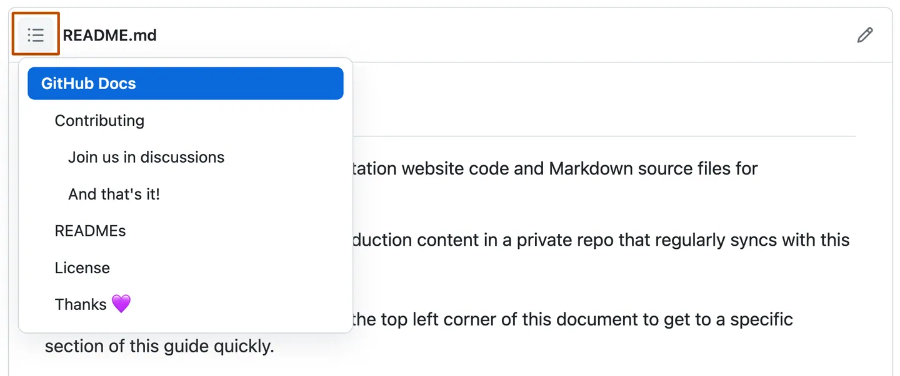

# Markdown基本撰寫和格式語法

## 標題樣式
要建立標題，請在標題文字之前添加一到六個 `#` 符號。 `#` 的數量將決定層次結構級別語標題的大小。

```
# A first-level heading
## A second-level heading
### A third-level heading
#### A fourth-level heading
##### A fifth-level heading
###### A sixth-level heading
```
# A first-level heading
## A second-level heading
### A third-level heading
#### A fourth-level heading
##### A fifth-level heading
###### A sixth-level heading


使用兩個或多個標題時，GitHub 會自動產生一個目錄，可以透過點擊檔案標題中的漢堡icon來存取該目錄。 每個標題都列在目錄中，可以按一下某個標題導覽到所選部分。



## 字體樣式

<table>
	<tr>
		<td>Style</td>
		<td>語法</td>
		<td>示例</td>
		<td>輸出</td>
	</tr>
	<tr>
		<td>加粗</td>
		<td>
			<code>** **</code> 或 <code>__ __</code>
		</td>
		<td>
			<code>**This is bold text**</code>
		</td>
		<td><strong>這是粗體文字</strong></td>
	</tr>
	<tr>
		<td>斜體</td>
		<td>
		<code>* *</code> 或 <code>_ _</code>
		</td>
		<td>
		<code>_This text is italicized_</code>
		</td>
		<td><em>這是斜體文字</em></td>
	</tr>
	<tr>
		<td>刪除線</td>
		<td>
			<code>~~ ~~</code>
		</td>
		<td>
			<code>~~This was mistaken text~~</code>
		</td>
		<td><del>這是錯誤文字</del></td>
	</tr>
	<tr>
		<td>上標</td>
		<td><code>&lt;sup&gt; &lt;/sup&gt;</code></td>
		<td>
			<code>This is a &lt;sup&gt;superscript&lt;/<wbr>sup&gt; text</code>
		</td>
		<td>這是<sup>上標</sup>文字</td>
	</tr>
	<tr>
		<td>下標</td>
		<td><code>&lt;sub&gt; &lt;/sub&gt;</code></td>
		<td>
			<code>This is a &lt;sub&gt;subscript&lt;/<wbr>sub&gt; text</code>
		</td>
		<td>這是<sub>下標</sub>文字</td>
	</tr>
</table>

## 引用文字

可以使用 `>` 來引用文字。
```
> Text that is a quote
```

Text that is not a quote

> Text that is a quote

## 引用代碼
使用單引號 ``` ` ``` 可標註句子中的代碼或指令。 反引號中的文字不會被格式化。 你也可以按下 Command+E (Mac) 或 Ctrl+E (Windows/Linux) 鍵盤捷徑將程式碼區塊的反引號插入到 Markdown 一行。

```
Use `git status` to list all new or modified files that haven't yet been committed.
```
Use `git status` to list all new or modified files that haven't yet been committed.

若要將程式碼或文字格式化為各自的不同區塊，請使用三反引號。

<pre>
Some basic Git commands are:
```
git status
git add
git commit
```
</pre>


Some basic Git commands are:
```
git status
git add
git commit
```
## 支援顏色模型
可以使用反引號在句子中標註顏色。 反引號內支援的顏色模型將顯示顏色的視覺化效果。
```
The background color is `#ffffff` for light mode and `#000000` for dark mode.
```
The background color is `#ffffff` for light mode and `#000000` for dark mode.

下面是當前支援的顏色模型。
<table>
	<tr>
		<td>Color</td>
		<td>語法</td>
		<td>示例</td>
		<td>輸出</td>
	</tr>
	<tr>
		<td>加粗</td>
		<td>
			<code>`#RRGGBB`</code>
		</td>
		<td>
			<code>`#0969DA`</code>
		</td>
		<td><code>`#0969DA`</code></td>
	</tr>
	
</table>